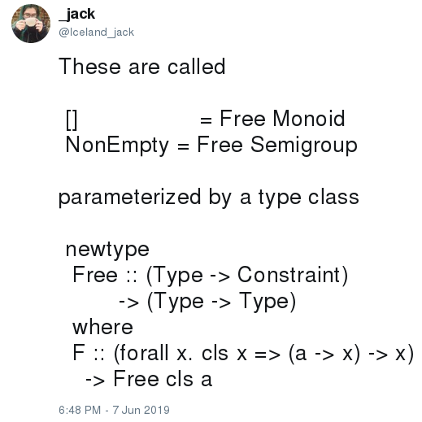

## Free

This project started when I saw [this tweet from \@Iceland\_jack](https://twitter.com/Iceland_jack/status/1137174517246242817):

<a href="https://twitter.com/Iceland_jack/status/1137174517246242817?ref_src=twsrc%5Etfw"> Constraint) 
         -> (Type -> Type) 
  where
  F :: (forall x. cls x => (a -> x) -> x)
    -> Free cls a</pre>

6:48 PM - June 8, 2019"></a>

(Though I didn't notice it at the time, \@Iceland\_jack credited [this issue of the comonad reader](http://comonad.com/reader/2015/free-monoids-in-haskell/) as the source for the construction).

We can use the same construction to define free monads:

```haskell
newtype Free0 cls a = Free0 { runFree0 :: forall b. cls b => (a -> b) -> b }

newtype Free1 cls f x = Free1 { runFree1 :: forall g. cls g => (forall t. f t -> g t) -> g x }

instance Functor (Free1 Monad f) where
  fmap = liftM

instance Applicative (Free1 Monad f) where
  pure a = Free1 $ const (pure a)
  (<*>) = ap

instance Monad (Free1 Monad f) where
  Free1 ma >>= g = Free1 $ \h -> ma h >>= \x -> g x `runFree1` h
```

Remarkably, unlike the typical construction of a free monad, say [from `Control.Monad.Free`](https://hackage.haskell.org/package/free-5.1.1/docs/Control-Monad-Free.html#t:Free), the `Monad` instance does not require that the parameter `f` is a `Functor`, only that it has kind `* -> *`.

Furthermore, this constraint on `f` isn't introduced by lifting `f a` values into `Free1 cls f a` values, or by evaluating `Free1 cls f a` in the context of some monad `g`. Lifting some terminology from [Lysxia](https://blog.poisson.chat/posts/2019-06-09-free-monads-free-monads.html), we can define these operations as:

```haskell
call :: f a -> Free1 cls f a
call fa = Free1 ($fa)

interpret :: cls g => (forall x. f x -> g x) -> Free1 f a -> g a
interpret h (Free1 ma) = ma h
```

Using `type (~>) f g = forall x. f x -> g x`, we can define `call` and `interpret` as a natural transformation and a mapping between natural transformations:

```haskell
call :: f ~> Free1 cls f
interpret :: cls g => (f ~> g) -> (Free1 cls f ~> g)
```

There's nothing specific to `Monad` about `call` or `interpret`; just as `Free0` can be used to define the free monoid or the free semigroup (or the free `Num`), `Free1` can be used to define other free structures on types of kind `k -> *`.

This can be generalized to generate free structures on types of kind `k0 -> k1 -> ... -> kN -> *`with data families:

```haskell
class HasFree k where
  data (~>) :: k -> k -> *
  data Free :: (k -> Constraint) -> k -> k

  call :: forall cls (a :: k). a ~> Free cls a
  interpret :: forall cls (a :: k) b. (a ~> b) -> (Free cls a ~> b)

instance HasFree * where
  newtype a ~> b = Natural0 { runNatural0 :: a -> b }
  newtype Free cls a = Free0 { runFree0 :: forall b. cls b => (a ~> b) -> b }

  call = Natural0 $ \a -> Free0 ($a)
  interpret h = (`runFree0` h)

instance HasFree (k -> *) where
  newtype a ~> b = Natural1 { runNatural1 :: forall x. a x -> b x }
  newtype Free cls a x = Free1 { runFree1 :: forall b. cls b => (a ~> b) -> b x }

  call = Natural1 $ \a -> Free1 ($a)
  interpret h = (`runFree1` h)

instance HasFree (j -> k -> *) where
  newtype a ~> b = Natural2 { runNatural2 :: forall x y. a x y -> b x y }
  newtype Free cls a x y = Free2 { runFree2 :: forall b. cls b => (a ~> b) -> b x y }

  call = Natural2 $ \a -> Free2 ($a)
  interpret h = (`runFree2` h)

-- ...
```

These 

## Concrete


- type/data families can skip parameter, use kind invisibly
- limitation; no free `Show`, free `Comonad`
- relationship to Reader, ConT, tagless final
- https://www.reddit.com/r/haskell/comments/qwklh/coexponentials/
- https://github.com/ekmett/hask/blob/master/src/Hask/Category.hs#L88
